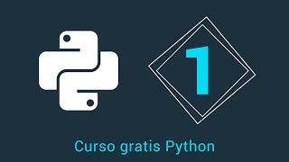
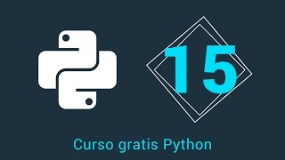
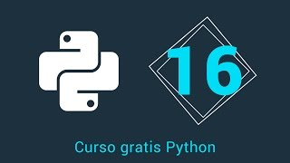
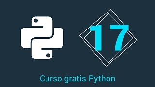
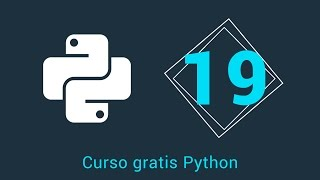
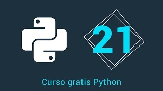
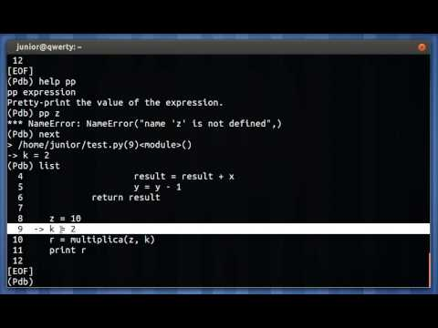

.. -*- coding: utf-8 -*-

.. _anexos_entrenamiento:

Anexos del entrenamiento
========================

A continuación varios material multimedia anexos a las lecciones del entrenamiento:

.. _anexos_mGH1uooFhGs:

    Vídeo `1.- Curso Python - Introducción <https://www.youtube.com/watch?v=mGH1uooFhGs>`_,
    cortesía de `CodigoFacilito.com`_.

.. _anexos_hF85etcCghY:

    Vídeo `15.- Curso Python - Funciones parte 1 <https://www.youtube.com/watch?v=hF85etcCghY>`_, cortesía de `CodigoFacilito.com`_.

.. _anexos_vMTV0hY2jio:

    Vídeo `16.- Curso Python - Funciones parte 2 <https://www.youtube.com/watch?v=vMTV0hY2jio>`_, cortesía de `CodigoFacilito.com`_.

.. _anexos_munC0mVXPWk:

    Vídeo `17.- Curso Python - Variables Globales <https://www.youtube.com/watch?v=munC0mVXPWk>`_, cortesía de `CodigoFacilito.com`_.

.. _anexos_PeWKpuFpGZA:

    Vídeo `18.- Curso Python - Argumentos <https://www.youtube.com/watch?v=PeWKpuFpGZA>`_, cortesía de `CodigoFacilito.com`_.

.. _anexos_Z-8Khdd2BUQ:

    Vídeo `14.- Curso Python - List Comprehension <https://www.youtube.com/watch?v=Z-8Khdd2BUQ>`_, cortesía de `CodigoFacilito.com`_.

.. _anexos_cJ9zcR1uTt8:

    Vídeo `19.- Curso Python - Lambdas <https://www.youtube.com/watch?v=cJ9zcR1uTt8>`_, cortesía de `CodigoFacilito.com`_.

.. _anexos_c9J7FHLjBds:

    Vídeo `21.- Curso Python - Decoradores <https://www.youtube.com/watch?v=c9J7FHLjBds>`_, cortesía de `CodigoFacilito.com`_.

.. _anexos_N4NtB4r28h0:

    Vídeo `Depurando um programa Python com pdb - Python Debugger <https://www.youtube.com/watch?v=N4NtB4r28h0>`_, cortesía de *Youtube*.

.. _anexos_aqnjB3dydik:

    Vídeo `13.- Curso Python - For <https://www.youtube.com/watch?v=aqnjB3dydik>`_, cortesía de `CodigoFacilito.com`_.

